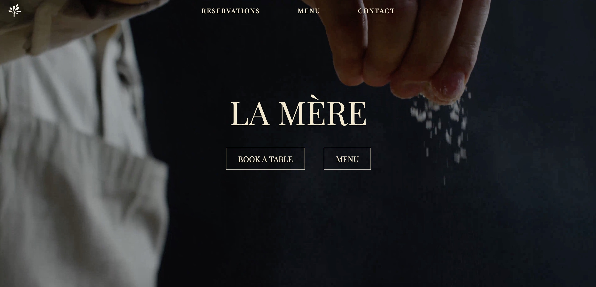
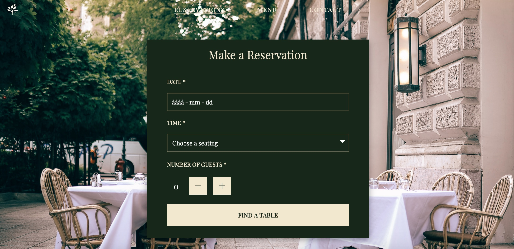
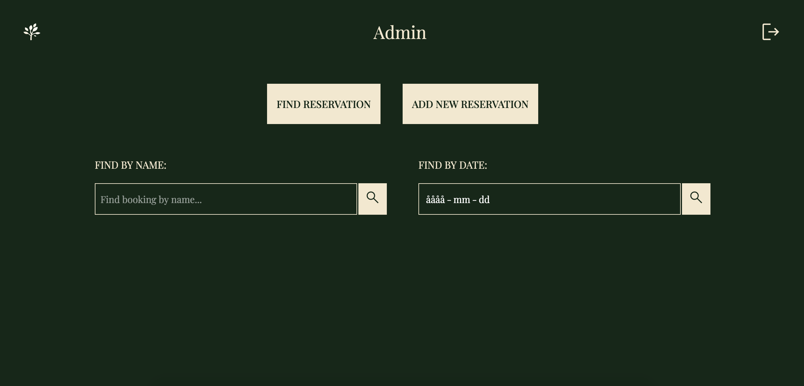
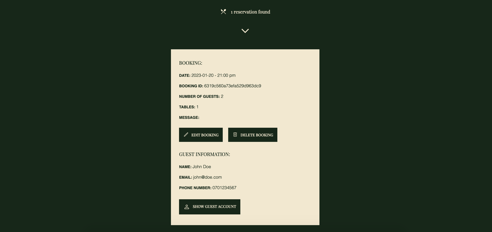

# Restaurant Booking App 📅 🍽️
Fullstack app using React, TypeScript and Styled components on the frontend and Node.js, Express and MongoDB on the backend.

## Table of contents
- [Overview](#overview)
- [Installation](#installation)
- [Testing with Cypress](#testing-with-cypress)
- [Email confirmation setup](#email-confirmation)
- [Access admin](#access-admin)
- [Login credentials](#login-credentials)
- [Screenshots](#screenshots)
- [Tools](#tools)

## Overview
This is a school project where we were tasked to create a restaurant website and booking system using React and TypeScript on the frontend and Node.js, Express and MongoDB on the backend. 

The restaurant has 3 seating each day and 15 tables in total. Each table can seat up to 6 guests. We created functionality to also accommodate larger groups, so the booking system reserves the amount of tables needed. 

The project features full authentication for admin/staff who can log in and perform CRUD operations (access all bookings, add, edit and remove bookings). 

After you make an online reservation, you will receive an email confirmation along with a cancellation link. 

End-to-end tests were implemented using Cypress.

## Screenshots

## Tools
React\
TypeScript\
Sass\
MongoDb\
Node\
Mongoose\
Nodemailer\
Cypress

## Installation
1. Clone the repo\
`git clone https://github.com/blaise442/reservation-system`

2. Install npm packages\
`npm i`

3. CD into repo\
`cd reservation-system`

4. Create a .env file
To run this application you'll need the following environment variables in a .env file in the backend folder:
- first create ,env file inside backend folder and define the below

PORT=4000
MONGO_URI=mongodb://localhost:27017
MAIL_USER="" create a gmail 
MAIL_PASS="" create a app password from security tab on gmail

5. Start server\( before starting the backend server make sure to have downloaded \ mongoDb compass and connect to it on your console)

`cd backend`\
`npm start`

5. Run React \
Open a new terminal\
`cd frontend`\
`npm start`

## Testing with Cypress:
1. Open terminal and cd into root directory\
`cd ..`

2. Install NPM packages\
`npm install`

3. Start Cypress\
`npx cypress open`

## Email confirmation
1. Sign in or create a free Gmail account. In the Security tab, activate 2 step verification and create an app password:\
https://myaccount.google.com/security

2. Add the credentials (your email address and app password) to variables in your .env file:\
MAIL_USER=”Your email address”\
MAIL_PASS=”Your app password”

## Access admin
 Downlaod mongodb client : https://www.mongodb.com/try/download/community
 brew install mongodb-community@7.0

 brew install mongodb-atlas && atlas deployments setup

 mongoimport --db restaurant_reservation --collection admins --file admins.json

1. Make sure to use the file - `"admins.json"` - and import it to `MongoDB`.

2. File is located in - `backend/db/admins.json`

3. Connect to your `MongoDB`

5. In MongoDB client when connected: go to the  database "test"

`Create collection =>`

`"admins" =>`

`"ADD DATA" =>`

`"Import File" =>`

`"admins.json"`( from backend/db)

## Login Credentials

Login at `"http://localhost:3000/admin"`

Admin: `EMAIL: admin@admin.io` - `PASS: admin`

Employee: `EMAIL: user@user.io` - `PASS: user`

`localhost:4000/admin/manage` is `NOT` fully functional yet.

## Authors
[Blaise Wangmeni](https://github.com/blaise442)\
[Allen Andrew](https://github.com/aallen483)\
[Krohn Avery](https://github.com/Avery-test)\
[Benchannouf El Mehdi](https://github.com/elmehdibenchannouf)\
[Lashmann Charles Gavin O](https://github.com/cgmann24)

